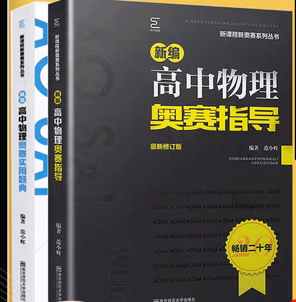
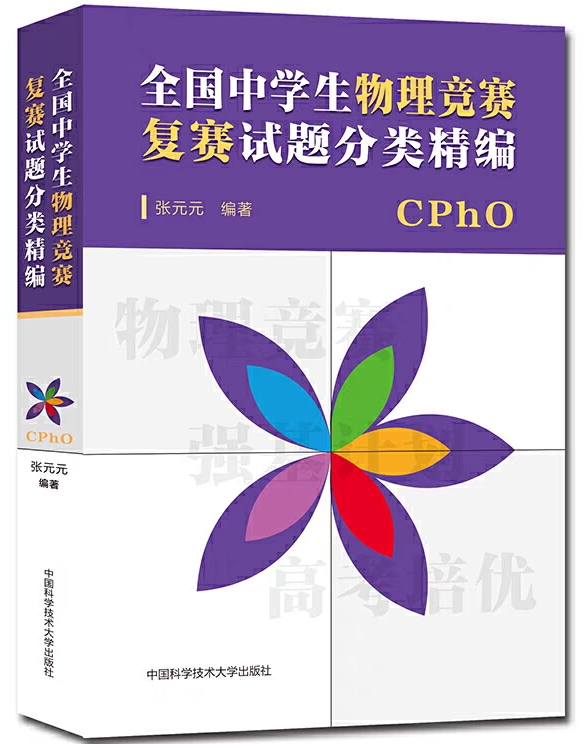
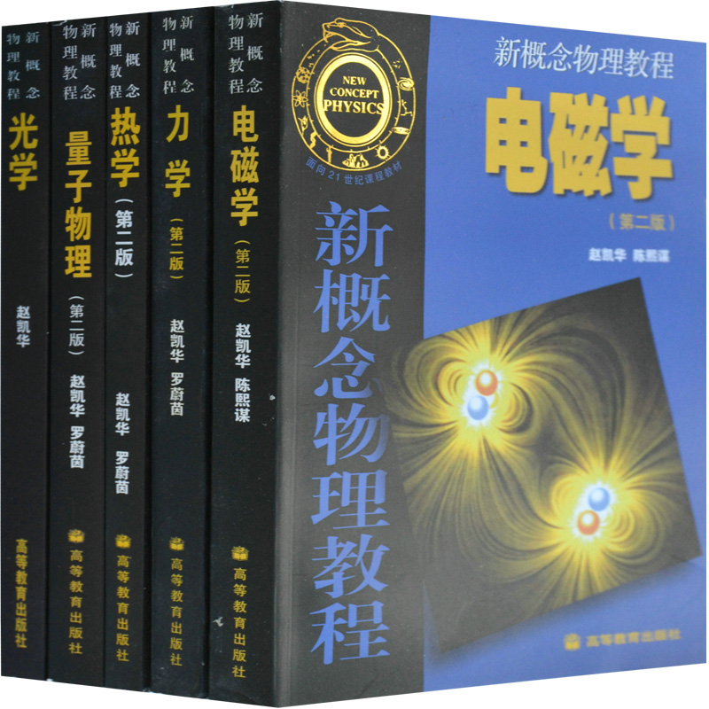

# 物理竞赛

## **物理竞赛**

### **2024届版**

_——两位热爱物理的学长_

### **一.序言**

如果说，高中物理课程的学习是让我们告别初中对物理浅显、片面的认知，以一个更全面的思维，初步体系化的认知，来接触物理学大厦的一砖半瓦，那么 ，物理竞赛的学习，就是以更严密的思维，更精妙的方法，以及更庞大的计算，来一瞥眼前的广阔物理世界。在这个过程中，你总会遇到前人留下的令人拍案叫绝的灵光一闪，或是亲自感受庞杂计算中的抽丝剥茧。这，就是物理竞赛的魅力所在。

### **二.以高中知识入门**

* 简介：只有扎实的高中知识基础，才能让我们在竞赛学习中无后顾之忧，尤其是对于不将竞赛考虑为升学方式的同学。将高中教材阅览一遍后，建议以网课和教辅的方式进行完善和练习巩固。
* 网课推荐：B站up HuangFuRen
* 教辅推荐：《必刷题》（因人而异）
* 进度：建议在高一前的暑假开始学习，在高一下学期中间完成即可，因人而异，应以适应高中各科的学习生活为重。最迟应在高一下的期末完成。
* 当你完成上述基础部分后，可以找几份高中综合模拟卷进行尝试，只求知识点基本掌握，不用担心不熟练，因为预赛的学习，可以让你的熟练度和理解提升一个档次。（如果想要竞赛含量较高的高中试卷，可以找湖南名校的考试，尤其是炎德英才大联考，在那里你甚至可以见到完整的预赛题目…）

### **三.预赛**

#### **学习**

* 预赛部分的学习，一定要全面完整，这既是为复赛的学习进行过渡，也可以帮助你以更高的视角审视高中的物理题目。
* 简介：内容主要分为运动学、力学、电磁学、热学、光学和近代物理等方面。刚开始接触时，可先对力学和电磁学进行重点学习，以此初步了解物理竞赛的学习方式，且该部分对高中物理的帮助较大，性价比较高。但切记不可偏废，其余部分在预赛的考试中也占有多道大题的分值。
*   教材推荐：

    《高中物理奥赛指导》及配套的《高中物理奥赛题典》（27届的年段大概率用这套）

    

    程书（对新手可能不太友好，也不用想着毕其功于一役，慢慢上手即可。）

    

    （以上两套教材二选一即可，有时间也可以都刷。）

    高等数学部分（按需，预赛对数学要求较低，但是复赛需要有一定的微积分基础）

    
* 网课推荐：
*   质心教育物理竞赛一轮

    （有帅气的蔡子星老师）

    （还有漂亮的王心冉老师）
* B站up 郭爷物理
* 校内选拔、考试：高一上学期刚开始会进行物理竞赛的选拔考试，难度较低，对高中物理必修部分有一定基础即可通过，大概率重点考查必修一部分。高一、高二下学期科技节期间都会进行物理竞赛的校内考试，难度比预赛略低。
* 校内培训：年段中的物理老师将轮流进行竞赛指导，时间为每周的校本选修课时间和某一天的晚自习，时长为一至二个小时。学习能力较强的同学可能觉得校内进度太慢，建议利用教材和网课资源加强自主学习，以保证正常进度。
* 校外培训：高一暑假
* 刷题：
* 前几年的真题
*   《全国中学生物理竞赛预赛试题分类精编》

    
* 进度：整个高一过程中逐步完成第一轮的学习。高一下的暑假较为清闲，如果此前已经打好了高中物理及预赛的基础，暑假的时间足够完成预赛部分的集中复习和刷题，以应对临近的预赛。

***

#### **考试**

* 考前准备：卡西欧计算机（型号:fx-991CN X）

可以B站找视频或者看说明书进行练习，上大学之后也会使用到

* 考试时间：高二、三年9月份的第一个周末上午9：00～12：00
* 考试内容：总分300分，各部分具体分值可以自行查看往年真题。第一轮的学习即可覆盖绝大部分的考点，即使存在一些较冷门的知识点，其所对应的分值也不会太多。
* 考场建议：
* 选择和填空每题的分值较多，会做的题目一定要拿下。
* 在选择题完成度较高的情况下，大题只需完成力所能及的部分，即可获得一个较好的成绩。
* 当然，上述所说要建立在第一轮学习扎实的基础上，对于预赛，只要能力在，一般不会出太大意外。
* 考试结果：一般在考完第二天公布，获得市一等奖的同学可以参加两周后举行的复赛。市一等奖大约一百人。

### **四.复赛**

#### **学习**

* 简介：复赛看似只是进行第二轮更深入的学习，但是其要求的物理方法和数学素养与一轮有着天壤之别，极可能耗费大量时间却仍然无法驾驭，因此，建议起步较晚且感觉难以把握的同学可以果断放弃，对于一中学子来说，高考才是危险性较低，较易于取得成功的道路。
*   教材推荐

    《难题集萃》

    

    《国培》

    

    《全国中学生物理竞赛复赛试题分类精编》

    

    《力学》

    

    《新概念物理》

    

    《数学物理方法》（按需）

    
* 网课推荐：
* 质心教育物理竞赛二轮
* 培尖教育物理竞赛二轮
*   校内培训：

    想啥呢，学校教不你了的啦
* 校外培训：
* 实验：高二暑假由省里面组织的实验培训，地点在福大或福师大。（光学实验的题做了那么多，总得去看看真正的）
*   理论：质心夏令营

    兰阶暑期培训（厦门）

    培尖教育暑期培训

    （上述三个任选其一即可）

#### **考试**

* 考试时间：预赛后第二周周末上午9：00～12：00
* 考试地点：考点位于福大或福师大。复赛前一天统一坐动车到福州南，入住酒店后前往考点报到。复赛当天傍晚坐动车返回。
* 考试内容：
* 理论部分：共八道大题，320分。不同年份的考点会有略微不同，考前也不要盲目押题，但是力学和电磁学占主要地位（一位不愿透露姓名的学长在40届复赛前总说一定考波动光学，于是开始苦读，当我们看到试卷上第一题的光具组时，仿佛听到了他心中沉默的呐喊）
* 实验部分：理论部分分数足够高的同学能入围实验部分，实验部分考完之后前六十名左右能获得省一等奖，并从中选出省队成员。
* 考场建议：
* 第一次参加复赛的同学，如果觉得对第二轮知识掌握不足，考试时可以选择三道知识点较熟悉的题目进行重点突破。也许两道完成度较高的题即可让你获得省二等奖。
* 对于第二轮学习已经完成的同学，想要在复赛大展拳脚，则一定要小心谨慎（上面提到的那位学长就在考场上写完一道大题之后发现忘了考虑摩擦力，于是…他的物理竞赛生涯就此画下了一个圆满的问号）
* 对经典的模型一定要熟悉（这两年复赛似乎有复古的倾向）常用的结论和表达式形式一定要牢记于心（既可以减小计算量也可以用于检验计算的准确性）
* 考试结果

理论和实验考试综合成绩在全省前六十 名的可以获得省一等奖，前十五左右可以进入省队，其他按成绩由高到低依次获得省二等奖，省三等奖（其实有参加复赛基本就能省三等奖）

### **五.决赛（ CPhO )**

**希望你能成为漳州一中近年来第一位进入省队的同学，于决赛中大显身手！加油吧！**

### **六.写给学弟学妹们的话**

**北海虽赊，扶摇可接；少年壮气，奋烈有时。过去的辉煌，已由前辈们慷慨铸就；明日的华章，尚需你们提笔写成。**

**物理漫途磳蹬常，潜心钻研终有偿。**

**平芜尽处是春山，且看学子争相攀。**

（偷偷告诉你，学物理竞赛可以帮助你找到另一半哦，这可是许多学长的美好往事，当然了，这也包括我们俩）

—两位热爱物理的学长
