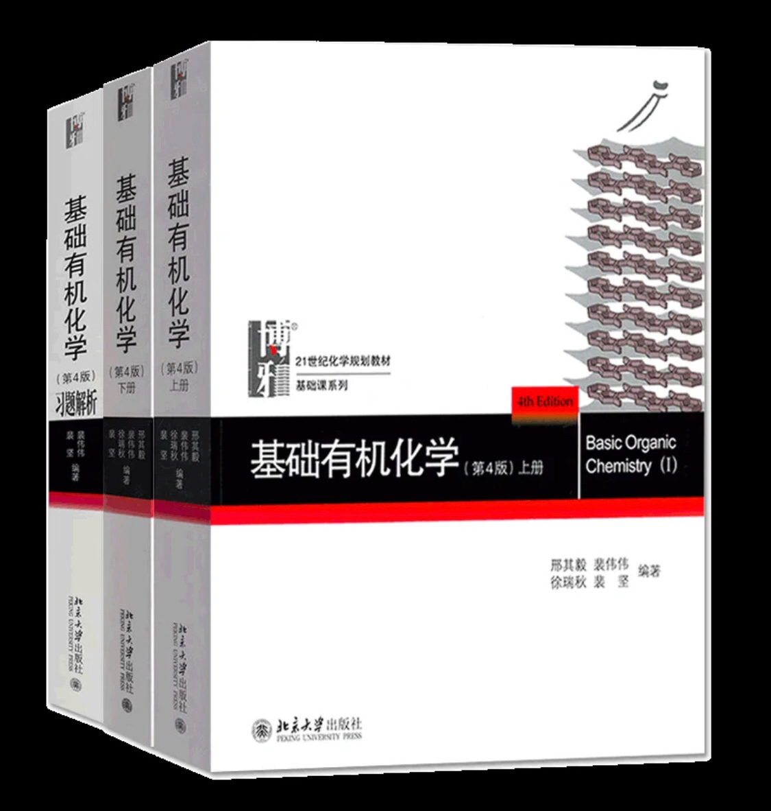
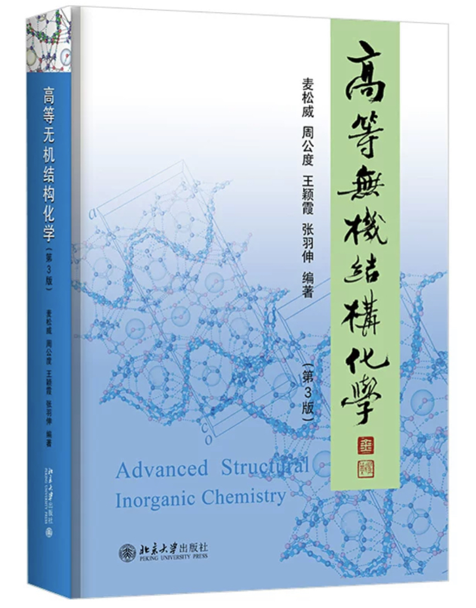
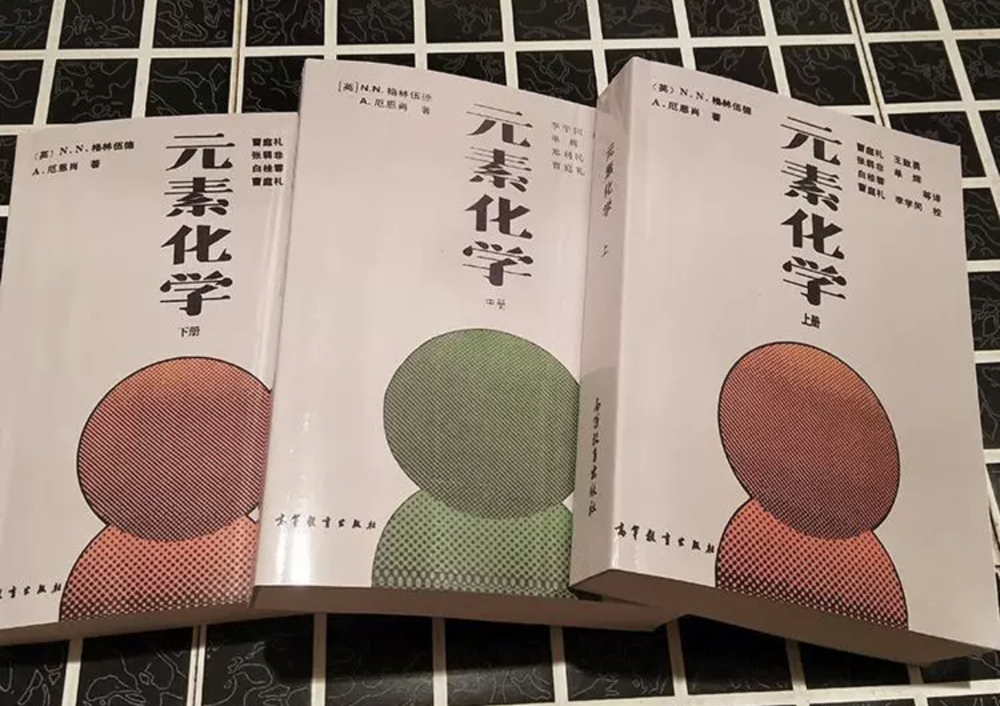
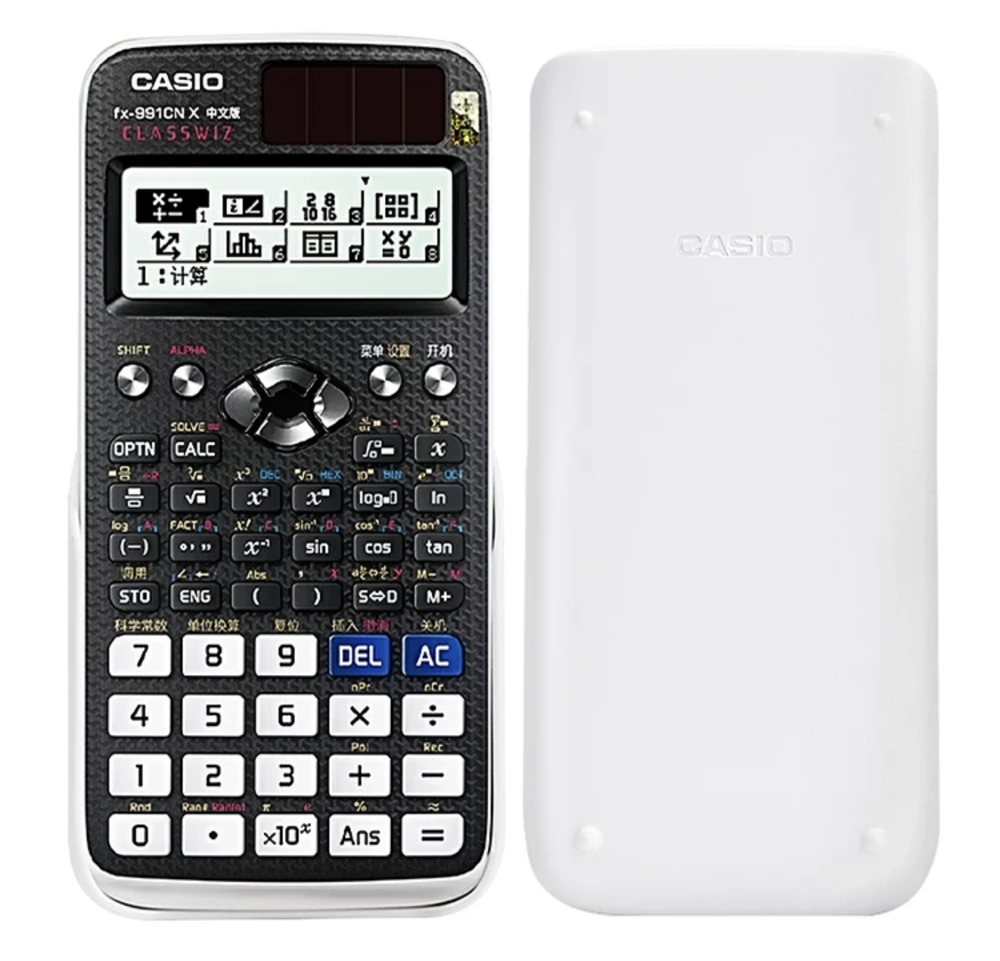
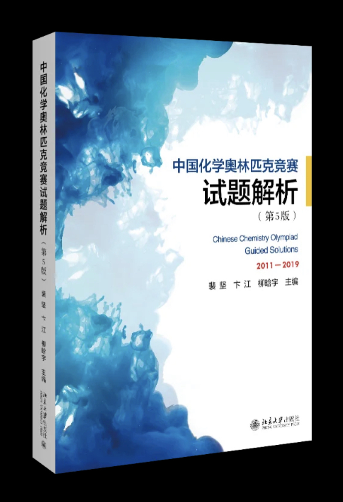

# 化学竞赛

## **化学竞赛**

### **2024届（两只省二）**

#### **一、入门**

高中化学相比于浅尝辄止的初中化学，具有更加丰富且深入的知识体系。\*\*但应当明白的是，高中化学的所有知识不过是竞赛的冰山一角。\*\*所以，“兴趣”使然、欲加入竞赛的同学，不妨先预览高中化学的知识体系再做出考虑。于竞赛生而言，必修一至选必三的全部内容最好能在入学次年六月前掌握且尽量熟练使用，这会使高二学习中课内化学无需分配较多的精力，有助于竞赛内容的精进。

*   **学习课本内容时，以下问题值得关注：**

    _1.课本元素化学的内容是否能形成体系？_

    _2.反应原理的基本理论与公式如何使用？_

    _3.物质的结构如何影响其物理化学性质？_

    _4.能否阅读与推导简单的有机合成路线？_

入门阶段的学习无需急于求成，也不依赖于任何其它高深的材料，但个人建议参考**人教版高中化学教科书**，示意图、注解相比福建地区使用的苏教/鲁科版更有利于自学掌握概念——当然，自学不必过量：开学后两周内，年段会举行竞赛选拔考以确定竞赛班名单，考试不难，找视频课看一看必修一即可。检验学习成果，做一做竞赛课配的高考总复习书附的练习册就足够。

*   **竞赛班概况：**

    高一、高二学年每周两节竞赛课，单节时长约90分钟，一节在选修课时间，一节在某一工作日晚自习。竞赛班初始人数接近一个标准班级，到高一学年末将退出一半左右。若自觉难以兼顾，或认为难度较高，可申请晚自习不去，但选修课应在竞赛班对应的教室报到，且学期末的选修课作业必须完成。作业通常为考察高中化学基础知识的试卷，对于智慧校园的综合素质评价必不可少，需要在期末考前上交。

    _（选修课相关，参考『选修课』）_

#### **二、预赛**

入学次年五月，会举行市级的预赛，主要考察元素化学、物理化学、有机化学的基础知识，学有余力的同学可以在考前一周浏览一些大学化学上述内容的知识点，但不必深究。参加不必在意名次，权当作体验题型，为来年顺利通过预赛进入国初做好准备。

**高中知识掌握后，可尝试阅读以下书目：**

* 宋天佑《无机化学》第四版

* 邢其毅《基础有机化学》第四版

*   麦松威、周公度、王颖霞、张羽伸

    《高等无机结构化学》晶体和配合物部分

上述书目配合视频课程可自学，个人推荐B站up主Babychem\*（自学有机要尽早开始）\*

另外，已确定高二继续的同学可以购置以下工具书，以便查询各种事实与原理：

* 格林伍德（Greenwood）《元素化学》

* 张祖德《无机化学》第二版

* Jie Jack Li（李洁）《有机人名反应》

| **有机人名反应浩如烟海，但是都得背，最好挨个画一遍，推一下机理，一天两个权当娱乐（呵呵），否则国初前只得望洋兴叹，四百个反应岂是说背就背？所以尽早学会有机的基础知识（邢大本前七章），能看懂机理就抓紧冲人名，不会错的。** |
| --------------------------------------------------------------------------------------------------------------- |

#### **三、入围**

预赛的结果会在考完两天内发布到各个学校（全是选择题，秒出分），获得市一等奖即可入围省赛（通常称为中国化学奥林匹克竞赛（CChO）初赛，即国初）。若获得二等奖，但分数接近切线且有意愿参加国初，可向年段负责竞赛的化学老师申请推荐，大概率也可以取得入围资格。_（注意：入围后因为已经签署保证书，不能退赛，即使不属于化学竞赛班也需要参加九月初省赛，会影响新高二开学衔接，非化竞同学谨慎考虑。）_

高一（暑假准高二）的同学，确定要继续参加竞赛的可以不报培训课程，适度自学并跟的学长一同参加九月初的初赛，权当作体验国初。就课内而言，需要兼顾选科分流后课内知识的加深加难，也不能轻视化学（不至于不选化学吧？？），应当认识到化学在课内考察的内容与竞赛出入是不小的。

| **忠告：参加竞赛通常结束在省二或省三，除非你是抱着进省队拿牌的决心读的竞赛，否则任何时候都不应轻视课内的学习考试，因为成为未进省队、回来高考的『偏科生』从来都是整个高中学习中的下下策。记住：先保障生活，再追求理想！** |
| -------------------------------------------------------------------------------------------------------------- |

高二（暑假准高三）的同学，需注意：

* 升入高二以来，竞赛进阶的四大化学（元素、有机、结构、分析）的自学工作应提上日程。另外，准备好计算器卡西欧fx-991 CN X并熟悉操作，\*\*一定要学会用计算器解方程、作线性回归分析、以及打表（用来猜相对分子质量之类），\*\*近年来过渡金属配位化学是热点，化合物式量满天飞，因此熟练使用你的卡西欧必不可少。
* 竞赛课形式不定，视频课质量参差不齐，如果老师讲课，内容较为基础也可以考虑尽快开始自学，\*\*记住不要被拖进度：等到高二上寒假，要对四大化学有大体的把握，达到能做基础题的程度。\*\*最好在四月份前做到尽量熟悉四大化学的知识体系，考预赛只需基础知识掌握清楚。预赛分数差点入围也无需灰心，因为考察内容有时与国初错位颇大，并不反映真实水平，可以尽量争取名额，别辜负一年半的学习。

| **读有机的建议：除了熟记人名反应和反复翻阅邢大本外，还需要关注保护基、特殊试剂、过渡金属催化（机理太复杂，会识别和写产物即可）。人名反应背完就去做福山机理，至少刷过AB组，B** |
| ------------------------------------------------------------------------------------------ |

*   **参考：竞赛指定型号计算器**

    

#### **四、国初**

初赛入围后，高二（准高三）的同学有三个多月的时间准备国初，推荐学有余力的同学尽早买《中国化学奥林匹克竞赛试题解析》开始刷历年国初题并找讲评视频弄懂。

近年来对配合物和晶体（尤其是2023年国初）的考察和以往的形式略有不同，更加考验学生的大胆猜测计算，以及对晶体的分析能力。因此，阅读《试题解析》时不仅要看国初题，相关的国决题也应尝试破解（尤其是计算+元素推断、计算+配合物、晶体等），同时一些机构的题目也可以作为借鉴，整合出自己适用的方法。

* 七月：年段一般会组织暑假报课，到杭州之类的城市培训一两个星期，可以顺便玩一玩。机构组织几次模拟考试，考几十分甚至十几分都正常，国初省二省三的分数线其实不高。
* 八月：新高三开始上课，考前两周若在学校可以申请到五楼自习，多看视频、多刷题、适当摸鱼，晚自习量力而行，最好兼顾课内，因为九月初可能还得回来考市一检。

国初一般在厦门举行，提前一天到考点所在的酒店住下（订酒店要趁早，不然可能订不到）好好休息。第二天一早考完，大部分同仁即告别竞赛生涯。若能够进入省队，恭喜你！之后的任务便是在国决中争取拿到银牌甚至金牌，就可以申请次年的破格强基了。

#### **五、后续**

退役化竞生除开其他科目的追补外，与化学老师搏斗也是一大问题。从竞赛化学深不见底的海洋中回归，需要明白高中化学十分浅薄，不必追求高中考题的知识严谨与理论完备，为了分数委曲求全才能安逸一些。但当创新题中出现老师难以解释的新机理、新性质时，就可以掏出压箱底的书本来帮忙了。

#### **六、杂谈**

高一刚接触化竞时，因探索各式各样新知，颇具胸有成竹之感，以至于开始深入时好奇心不免消磨，有些麻木。高二选科的挑战，加上物理化学、配位化学的抽象亦劝退了一部分人。坚持下来的多是因为热爱：竞赛肯定不是一心为了搞钱（国初获奖是有一两千的），其目的是丰富知识、发展能力与锚定专业，因此不必强求。另外，如果学习有机化学屡屡受挫，是太正常不过的现象，即使是邢大本这一入门款（基础有机化学）也能挂科无数化学专业大学生，作为学了一年多的竞赛生也不必痛苦。有机化学从来没有简单过，但一切基础的反应机理还是应该烂熟于心。另外，元素化学务必拿下，写方程式与配位化合物的分析通常最好拿分，也最不应失分，方法就是多看多记多做。至于热力学、电化学更是不必说，国初一般不考动力学，所以ΔG，K°，E/φ的各种关系应该无条件掌握，也属于必做必拿的。

化竞需要计算、记忆、猜测与推演，是文理兼修的综合型竞赛，倘若你已立志投身化竞，那么，我们衷心祝你成功，一往无前！
